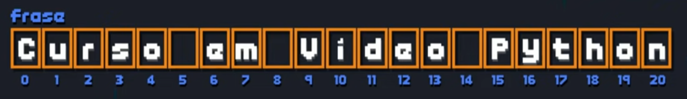
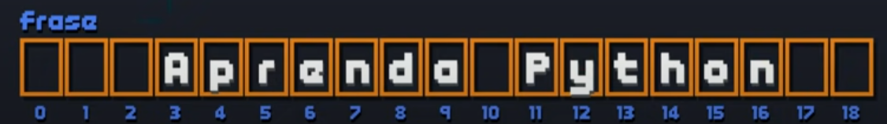
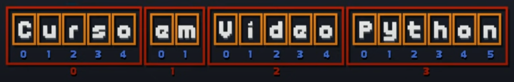

# Aula 9

## Manipulando Texto
Nessa aula, vamos aprender operações com String no Python. As principais operações que vamos aprender são o Fatiamento de String, Análise com ``len()``, ``count()``, ``find()``, transformações com ``replace()``, ``upper()``, ``lower()``, ``capitalize()``, ``title()``, ``strip()``, junção com ``join()``.


### Cadeia de caracteres

Exemplo de cadeia de caracteres

``` py
frase = 'Curso em Video Python'
```


#### Fatiamento

``` py
frase[9]
'V'
```

``` py
frase[9:13]
'Vide'
```

``` py
frase[9:21]
'Video Python'
```

``` py
frase[9:21:2]
'VdoPto'
```

``` py
frase[:5]
'Curso'
```

``` py
frase[15:]
'Python'
```

``` py
frase[9::3]
'VePh'
```

#### Análise

``` py
len(frase)
21
```

``` py
frase.count('o')
3
```

``` py
frase.count('o',0,13)
1
```

``` py
frase.find('deo')
11
```

``` py
frase.find('Android')
-1
```

``` py
'Curso' in frase
True
```

#### Transformação

``` py
frase.replace('Python','Android')
'Curso em Video Android'
```

``` py
frase.upper()
'CURSO EM VIDEO PYTHON'
```

``` py
frase.lower()
'curso em video python'
```

``` py
frase.capitalize()
'Curso em video python'
```

``` py
frase.title()
'Curso Em Video Python'
```

 ##### Nova Frase:

``` py
frase = '   Aprenda Python  '
```


``strip()`` - remove espaços inúteis:
``` py
frase.strip()
'Aprenda Python'
```

``` py
frase.rstrip()
'   Aprenda Python'
```

``` py
frase.lstrip()
'Aprenda Python  '
```

#### Divisão

``` py
frase = 'Curso em Video Python'
```


`split()` - Cria uma divisão na variável onde existir espaços 
``` py
frase = frase.split()
print(frase)
['Curso', 'em', 'Video', 'Python']
```


#### Junção

``` py
'-'.join(frase)
'Curso-em-Video-Python'
```