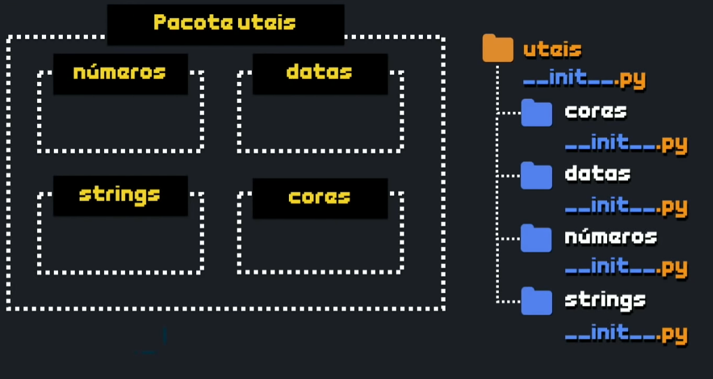

# Aula 22

## Módulos e Pacotes

Nessa aula, vamos continuar nossos estudos de funções em Python, aprendendo como criar módulos em Python e reutilizar nossos códigos em outros projetos. Vamos aprender também como agrupar vários módulos em um pacote, ampliando ainda mais a modularização em grandes projetos em Python.

### Modularização

* Surgiu no início da decade de 60
* Sistemas ficando cada vez maiores
* Foco: dividir um programa grande
* Foco: aumentar a legibilidade
* Foco: facilitar a manutenção


```py
def fatorial(n):
    f = 1
    for c in range(1, n+1):
        f *= c
    return f

def dobro(n):
    return n*2

def triplo(n):
    return n*3


num = int(input("Digite um valor: "))
fat = fatorial(num)
print(f"O fatorial de {num} é {fat}.")
```

Um código grande pode ser divido para se tornar modular:

Módulo: `uteis.py`
```py
def fatorial(n):
    f = 1
    for c in range(1, n+1):
        f *= c
    return f

def dobro(n):
    return n*2

def triplo(n):
    return n*3
```

Importar o módulo que foi customizado:

```py
import uteis

num = int(input("Digite um valor: "))
fat = uteis.fatorial(num)
print(f"O fatorial de {num} é {fat}.")
```


### Vantagens

* Organização do código
* Facilidade da manutenção
* Ocultação de código detalhado
* Reutilização em outros projetos


## Pacotes

Junção de módulos separados por assunto, que nada mais é que uma pasta que contêm módulos.

Para criar um pacote basta criar uma pasta e adicionar em cada pasta um módulo.

Existe uma sintaxe especial para nome de arquivo dentro de pacotes, um arquivo especial para colocar dentro de cada uma destas pastas: `__init__.py`




Para criar um pacote chamado `uteis`, escolha o caminho `New > Python Package`:


